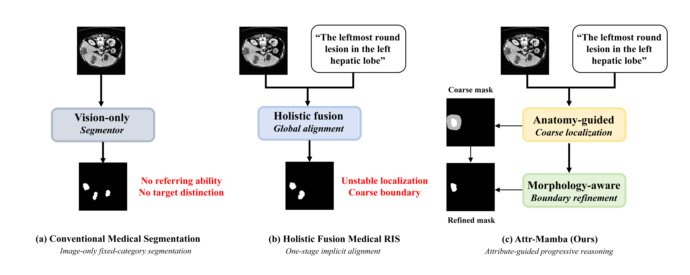
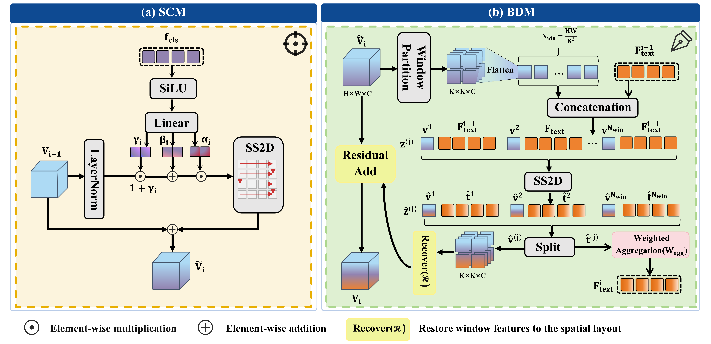
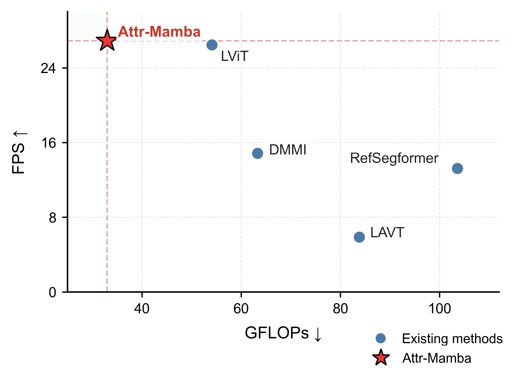

# Attr-Mamba

**Attr-Mamba: Attribute-Guided State Space Model for Progressive Medical Referring Image Segmentation** 的官方实现。

Attr-Mamba 面向医学指代图像分割（Medical Referring Image Segmentation，Medical RIS）任务，根据临床风格的自然语言描述分割病灶或目标区域。该框架通过渐进式状态空间解码器，将用于定位的解剖/空间线索与用于边界细化的形态学线索进行解耦。

## 主要特点

- 通过解剖引导定位和形态感知边界细化，实现渐进式医学指代图像分割。
- 在 `datasets/` 中提供 Ref-LITS 和 Ref-LIDC 的临床风格指代描述。
- 使用固定阈值进行透明评测，不采用连通域后处理。

## 环境要求

推荐使用 Python 3.10。编译 selective-scan 扩展需要与当前 PyTorch 版本兼容的 CUDA 工具包。

```bash
conda create -n attr-mamba python=3.10
conda activate attr-mamba
pip install -r requirements.txt
cd selective_scan
pip install .
cd ..
```

从头训练时，代码需要以下外部预训练骨干网络：

- RadBERT：通过 `--bert_path` 指定，或放置于 `./checkpoint/RadBERT`
- Swin-T：通过 `--swin-pretrained` 指定，或放置于 `./checkpoint/swin_T/swin_tiny_patch4_window7_224.pth`

## 仓库结构

```text
Attr-Mamba/
|-- main.py                 # 训练与评测入口
|-- engine.py               # 优化过程与指标计算
|-- model/                  # Attr-Mamba 架构与视觉编码器
|-- vmamba_model/           # 状态空间模型基础模块
|-- selective_scan/         # CUDA selective-scan 扩展
|-- ref_dataset/            # 医学指代分割数据加载器
|-- datasets/               # 临床风格文本描述
`-- assets/figures/         # README 使用的方法图与结果图
```

## 快速开始

在 Ref-LITS / Ref-LIDC 格式的数据上训练：

```bash
python -m torch.distributed.launch --nproc_per_node=2 --use_env main.py \
  --distributed \
  --model AttrMamba \
  --data-set ref-lits \
  --data-path ./datasets/Ref-LITS \
  --json-prefix ref_lits \
  --image-size 512 \
  --output_dir ./outputs/ref_lits \
  --batch_size 4 \
  --epochs 200 \
  --lr 1e-4 \
  --weight-decay 0.05
```

评测：

```bash
python main.py \
  --eval \
  --model AttrMamba \
  --data-set ref-lits \
  --data-path ./datasets/Ref-LITS \
  --json-prefix ref_lits \
  --test-split test \
  --resume ./outputs/ref_lits/best_checkpoint.pth
```

评测时对原始 sigmoid 输出使用 `0.5` 阈值，不采用连通域筛选或隐藏后处理。评测指标包括 mIoU、mDice、oIoU 和 HD95。训练数据加载器仅执行确定性的缩放与归一化，不启用随机数据增强。

默认情况下，评测过程不会保存样本级日志或可视化结果。若要导出定性结果，请显式指定可视化目录：

```bash
python main.py \
  --eval \
  --model AttrMamba \
  --data-set ref-lits \
  --data-path ./datasets/Ref-LITS \
  --json-prefix ref_lits \
  --test-split test \
  --resume ./outputs/ref_lits/best_checkpoint.pth \
  --vis-dir ./vis_results/ref_lits
```

训练过程会将 `checkpoint.pth`、`best_checkpoint.pth` 和 `log.txt` 写入 `--output_dir`。在相同软件与硬件配置下，可通过设置 `--seed` 复现实验。

## 公开文本描述

仓库提供经过整理的指代描述，用于检查临床风格语言部分：

| 文件 | 描述数量 | 说明 |
| --- | ---: | --- |
| `datasets/Ref-LITS_descriptions.json` | 14,883 | 肝脏病灶指代描述 |
| `datasets/Ref-LIDC_descriptions.json` | 8,721 | 肺结节指代描述 |

示例条目的格式如下：

```json
{
  "file_id": 1,
  "sentence": "A tiny, round hypodensity with heterogeneous texture and well-circumscribed margins is located in the superior hepatic region."
}
```

## 方法概述

Attr-Mamba 采用级联式编码器-解码器设计：

- **文本编码器**：冻结的 RadBERT 提取句子级和词元级语言特征。
- **视觉编码器**：Swin Transformer 提取高层图像表征。
- **SCM**：使用句子级解剖先验校准视觉状态，实现稳定定位。
- **BDM**：词元级形态线索通过 Mamba/SSM 风格的状态空间建模与局部视觉窗口交互，以细化目标边界。
- **优化目标**：`Ldice + Lfocal + 0.1 * Lbound`，边界权重图为 `W = 1 + 5B`。

<p align="center">
            
</p>

<p align="center"><b>概念对比。</b>Attr-Mamba 将解剖引导定位与形态感知边界细化相结合，实现属性引导的粗到细医学指代图像分割。</p>

## 整体框架

<p align="center">
          
</p>

<p align="center"><b>整体框架。</b>给定医学图像和指代文本，Attr-Mamba 提取视觉状态、句子级解剖先验和词元级文本状态。级联解码首先执行基于 SCM 的语义校准，随后通过 BDM 细化边界，并输出多阶段预测掩码。</p>

<p align="center">
    
</p>

<p align="center"><b>核心机制。</b>SCM 使用句子级解剖先验进行 AdaLN 风格的视觉校准和门控 SS2D 残差注入。BDM 使用词元级形态线索和局部视觉窗口完成状态空间交互与文本状态更新。</p>

## 实验结果

下表汇总了部分基准实验结果，评测指标包括 mIoU、mDice 和 HD95。

| 数据集 | mIoU | mDice | HD95 | 说明 |
| --- | ---: | ---: | ---: | --- |
| Ref-LITS | 69.62 | 78.41 | 10.20 | mIoU 比次优方法高 6.08 |
| Ref-LIDC | 63.44 | 76.07 | 7.04 | mIoU 比次优方法高 1.96 |
| QaTa-COV19 | 85.77 | 92.15 | 11.63 | 在对比方法中取得最佳 mIoU 和 mDice |
| MosMedData+ | 66.01 | 79.61 | 13.19 | 在对比方法中取得最佳 mIoU 和 HD95 |

<p align="center">
           
</p>

<p align="center"><b>定性对比。</b>黄色、红色和绿色分别表示真阳性、假阴性和假阳性区域。</p>

### 消融实验

| SCM | BDM | Ref-LITS mIoU | Ref-LIDC mIoU | QaTa-COV19 mIoU | MosMedData+ mIoU |
| --- | --- | ---: | ---: | ---: | ---: |
| - | - | 57.11 | 53.96 | 74.06 | 58.23 |
| Yes | - | 59.73 | 55.93 | 76.60 | 60.01 |
| - | Yes | 62.94 | 57.07 | 78.13 | 61.36 |
| Yes | Yes | 69.62 | 63.44 | 85.77 | 66.01 |

| 渐进阶段数 | Ref-LITS mIoU | Ref-LITS mDice | Ref-LITS HD95 | 参数量 | GFLOPs | FPS |
| ---: | ---: | ---: | ---: | ---: | ---: | ---: |
| 1 | 65.51 | 74.72 | 13.89 | 184.16M | 211.70 | 22.15 |
| 2 | 66.72 | 76.03 | 12.94 | 185.85M | 212.21 | 20.91 |
| 3 | 68.03 | 77.46 | 11.72 | 192.12M | 213.89 | 18.54 |
| 4 | 69.62 | 78.41 | 10.20 | 216.20M | 219.89 | 16.85 |

<p align="center">
      
</p>

<p align="center"><b>分阶段热力图。</b>空间响应从宽泛的候选区域逐步收敛到指代病灶周围的集中激活区域。</p>

### 效率

<p align="center">
  
</p>

在 224 x 224 分辨率的 QaTa-COV19 数据集上，Attr-Mamba 的计算量为 32.97 GFLOPs，推理速度达到 26.88 FPS。与 LAVT、DMMI、LViT 和 RefSegformer 相比，GFLOPs 分别降低 60.7%、47.9%、39.1% 和 68.2%。

### 文本扰动与鲁棒性

<p align="center">
       
</p>

<p align="center"><b>受控提示词扰动。</b>空间扰动主要影响定位性能，而形态扰动主要影响边界质量。</p>

| 数据集 | 文本设置 | mIoU | mDice | 中心距离 | 边界 F-score | HD95 |
| --- | --- | ---: | ---: | ---: | ---: | ---: |
| Ref-LITS | 原始描述 | 76.96 | 86.31 | 2.15 | 78.00 | 6.19 |
| Ref-LITS | 空间扰动 | 45.78 | 50.90 | 80.34 | 42.00 | 86.54 |
| Ref-LITS | 形态扰动 | 70.35 | 79.26 | 12.91 | 68.00 | 19.14 |
| Ref-LIDC | 原始描述 | 67.59 | 79.26 | 4.18 | 84.00 | 6.56 |
| Ref-LIDC | 空间扰动 | 31.74 | 45.31 | 92.21 | 49.00 | 92.41 |
| Ref-LIDC | 形态扰动 | 62.69 | 74.69 | 6.71 | 76.00 | 9.23 |

| 数据集 | 文本输入 | mIoU | mDice | HD95 |
| --- | --- | ---: | ---: | ---: |
| Ref-LITS | 原始文本 | 75.15 | 85.37 | 4.91 |
| Ref-LITS | 临床风格文本 | 72.37 | 82.46 | 8.29 |
| Ref-LIDC | 原始文本 | 60.89 | 74.78 | 2.89 |
| Ref-LIDC | 临床风格文本 | 60.35 | 74.20 | 4.36 |

## 可复现性说明

- 数据集划分严格读取指定的 JSON 文件，加载器不会创建或修改数据划分。
- 图像使用双线性插值缩放，掩码使用最近邻插值缩放。
- 不使用随机数据增强、小目标筛选或连通域目标选择。
- 评测时以 `0.5` 为阈值处理原始 sigmoid 输出，并报告 mIoU、mDice、oIoU 和 HD95。

## 联系方式

如对代码实现有疑问，请联系 Wenhui Huang：`whhuang.sdu@gmail.com`。

## 致谢

本实现基于 Swin Transformer、VMamba/Mamba 风格 selective scanning、RadBERT 及已有指代图像分割代码库中的开源组件。感谢相关项目的作者和维护者。
